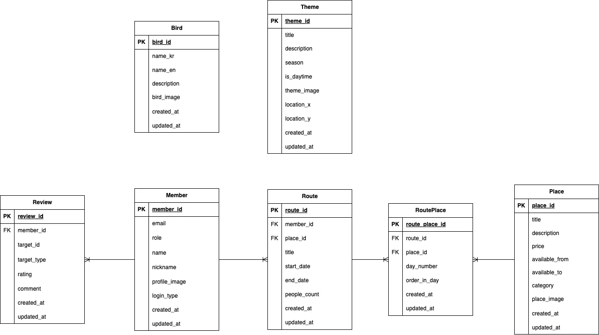

# 🐦 Showing Backend Repository

## 📌 개요

Showing은 탐조 중심 개인 맞춤형 생태 여행 플래너입니다.<br>
기존의 생태 관광 서비스들은 분산된 정보, 낮은 접근성, 획일적인 루트 제공 문제를 가지고 있습니다.<br>
우리 서비스는 공공 데이터 기반으로 사용자 맞춤형 루트 생성, 추천, 예약까지 연동하는 A to Z 생태 여행 서비스를 제공합니다.<br>

## 🎯 Showing의 목표

1️⃣ 흩어진 생태 관광 정보를 한곳에 모아 사용자 친화적으로 제공<br>
2️⃣ 사용자 맞춤 루트 추천 및 개인화된 여행 계획 생성<br>
3️⃣ 생태 관광 초보자도 쉽게 즐길 수 있는 정보 및 예약 서비스 제공<br>
4️⃣ 지역 경제 활성화 및 환경 보호 교육 확산에 기여<br>

## 🛠️ 주요 기능
| 🏷️ 카테고리 | 🛠️ 기능 설명 |
|------------|-------------|
| **회원** | 소셜 로그인 |
| **루트** | 개인 루트 생성, 수정, 삭제, 공유 |
| **추천** | 계절·시간대·위치 기반 명소 추천 |
| **예약** | 숙소 및 체험 프로그램 예약 연동 |
| **리뷰** | 명소 및 프로그램 리뷰 등록·조회 |
| **장소** | 탐조 명소 및 주변 장소 데이터 관리 |

## 📂 프로젝트 구조
```
showing
 ├── .github/                     # GitHub 관련 설정
 ├── .gradle/                     # Gradle 빌드 관련 파일
 ├── .idea/                       # IntelliJ 프로젝트 설정 파일
 ├── build/                       # 빌드된 파일
 ├── docs/                        # 문서에 사용되는 자료
 ├── gradle/                      # Gradle 래퍼 관련 파일
 ├── out/                         # 컴파일된 클래스 파일
 ├── src/
 │   ├── main/
 │   │   ├── java/com/chaeum/api/
 │   │   │   ├── domain/             # 도메인별 계층 구조
 │   │   │   │   ├── controller/     # API 컨트롤러
 │   │   │   │   ├── dto/            # 데이터 전송 객체
 │   │   │   │   ├── entity/         # JPA 엔티티 클래스
 │   │   │   │   ├── repository/     # 데이터베이스 인터페이스
 │   │   │   │   ├── service/        # 비즈니스 로직 처리
 │   │   │   ├── global/             # 공통 모듈 및 전역 설정
 │   │   │   │   ├── auth/           # JWT 인증/인가 관련 로직
 │   │   │   │   ├── config/         # 스프링 설정 클래스
 │   │   │   │   ├── entity/         # 공통 엔티티 클래스
 │   │   │   │   ├── exception/      # 전역 예외 처리 클래스
 │   │   │   │   ├── filter/         # 인증/로깅 등 서블릿 필터
 │   │   │   │   ├── handler/        # 전역 예외 핸들러
 │   │   │   │   ├── properties/     # 커스텀 application.yml 설정 매핑
 │   │   │   │   ├── response/       # 표준 API 응답 포맷 클래스
 │   │   │   │   ├── utils/          # 공통 유틸리티 클래스
 │   │   │   ├── ShowingApiApplication.java  # 메인 실행 파일
 │   │   ├── resources/
 │   │   │   ├── static/             # 정적 리소스
 │   │   │   ├── templates/          # 템플릿 파일
 │   │   │   ├── application.yml.template       # 환경 설정 템플릿
 ├── .gitattributes
 ├── .gitignore
 ├── build.gradle
 ├── gradlew
 ├── gradlew.bat
 ├── HELP.md
 ├── README.md
 ├── settings.gradle
```

## 🖥️ 시스템 아키텍처 다이어그램
[추후 추가 예정]

## 🗂️ ERD (Entity Relationship Diagram)


