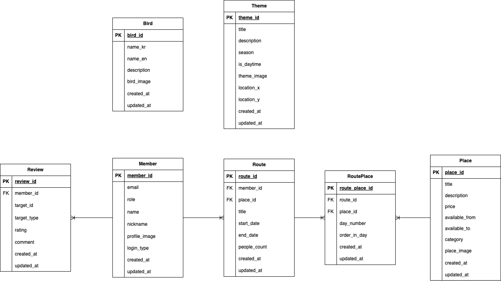

# 🐦 Showing Backend Repository

## 📌 개요

Showing은 초등학생 안심 생태 여행 플래닝 서비스입니다.<br>
주요 탐조 명소를 기반으로 관광지의 안전도와 혼잡도 정보를 제공하여 교사와 학생이 안심하고 참여할 수 있는 지속가능한 현장체험학습을 지원합니다.<br>
교사는 안전 부담을 줄이고, 학생은 생태·환경 교육을 체험할 수 있도록 설계된 탐조 특화 현장체험학습 플랫폼입니다.<br>

## 🎯 Showing의 목표

1️⃣ 학생은 만족하고 교사는 안심할 수 있는 지속가능한 현장체험학습 지원<br>
2️⃣ 주요 탐조 명소와 주변 관광지 정보를 통합 제공<br>
3️⃣ 안전도·혼잡도 데이터 기반으로 실질적인 교사의 부담 완화<br>
4️⃣ 교사·학생이 직접 탐조 루트와 활동 기록을 생성·공유할 수 있는 교육 콘텐츠 생태계 구축<br>

## 🛠️ 주요 기능
| 🏷️ 카테고리 | 🛠️ 기능 설명 |
|------------|-------------|
| **회원** | 소셜 로그인 |
| **플래닝** | 탐조 테마 기반 여행 루트 생성·수정·공유 |
| **추천** | 계절·시간대·위치 기반 탐조 명소 및 주변 관광지 추천 |
| **안전·혼잡도** | 정부·지자체 안전 정보 제공, 혼잡도 API 매칭 (시·군·구 단위) |
| **예약** | 숙소 및 체험 프로그램 예약 연동 |
| **리뷰** | 명소 및 프로그램 리뷰 등록·조회 |
| **활동기록** | 학교별 탐조 활동 기록 관리 및 공유 |
| **장소** | 탐조 명소 및 주변 장소 데이터 관리 |
| **팀** | 팀 생성 및 가입 |

## 📂 디렉토리 구조
```
showing
 ├── .github/                     # GitHub 관련 설정
 ├── .gradle/                     # Gradle 빌드 관련 파일
 ├── .idea/                       # IntelliJ 프로젝트 설정 파일
 ├── build/                       # 빌드된 파일
 ├── docs/                        # 문서에 사용되는 자료
 ├── gradle/                      # Gradle 래퍼 관련 파일
 ├── out/                         # 컴파일된 클래스 파일
 ├── src/
 │   ├── main/
 │   │   ├── java/com/chaeum/api/
 │   │   │   ├── domain/             # 도메인별 계층 구조
 │   │   │   │   ├── controller/     # API 컨트롤러
 │   │   │   │   ├── dto/            # 데이터 전송 객체
 │   │   │   │   ├── entity/         # JPA 엔티티 클래스
 │   │   │   │   ├── repository/     # 데이터베이스 인터페이스
 │   │   │   │   ├── service/        # 비즈니스 로직 처리
 │   │   │   ├── global/             # 공통 모듈 및 전역 설정
 │   │   │   │   ├── auth/           # JWT 인증/인가 관련 로직
 │   │   │   │   ├── config/         # 스프링 설정 클래스
 │   │   │   │   ├── entity/         # 공통 엔티티 클래스
 │   │   │   │   ├── exception/      # 전역 예외 처리 클래스
 │   │   │   │   ├── file/           # 파일 업로드 클래스
 │   │   │   │   ├── filter/         # 인증/로깅 등 서블릿 필터
 │   │   │   │   ├── handler/        # 전역 예외 핸들러
 │   │   │   │   ├── properties/     # 커스텀 application.yml 설정 매핑
 │   │   │   │   ├── response/       # 표준 API 응답 포맷 클래스
 │   │   │   │   ├── utils/          # 공통 유틸리티 클래스
 │   │   │   ├── ShowingApiApplication.java  # 메인 실행 파일
 │   │   ├── resources/
 │   │   │   ├── static/             # 정적 리소스
 │   │   │   ├── templates/          # 템플릿 파일
 │   │   │   ├── application.yml.template       # 환경 설정 템플릿
 ├── .gitattributes
 ├── .gitignore
 ├── build.gradle
 ├── gradlew
 ├── gradlew.bat
 ├── HELP.md
 ├── README.md
 ├── settings.gradle
```

## 🖥️ 시스템 아키텍처 다이어그램
[추후 추가 예정]

## 🗂️ ERD (Entity Relationship Diagram)


